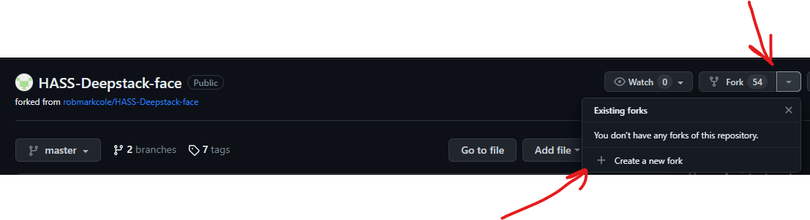
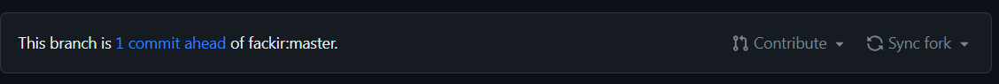

# Инструкция по работе с git

## Что это и для чего нужна система контроля версий?

### Что такое система контроля версий?
Эта система позволяет хранить историю изменения файлов, с авторами.
Система контроля версий — это система, записывающая изменения в файл или набор файлов в течение времени и позволяющая вернуться позже к определённой версии. 

### Для чего нужна система контроля версий
* Система контроля версий помогает разработчикам параллельно работать над проектом, не мешать друг другу и добавлять в master-ветку только качественный код.

## Установка git и VSCode на ваш ПК.

### Установка VSCode на ваш ПК.
* Переходим на сайт code.visualstudio.com, секция Download. Здесь есть версия под Mac, Linux. Меня интересует Windows. Нажимаем и скачиваем себе на ПК. Программа скачана, запускаем инсталлятор и следуем инструкциям: принимаем, добавляем все галочки, далее, ждем пока программа установится на наш ПК.

### Установка git на ваш ПК
* Для установки Git в Windows также имеется несколько способов. Официальная сборка доступна для скачивания на официальном сайте Git. Просто перейдите на страницу https://git-scm.com/download/win, и загрузка запустится автоматически. Обратите внимание, что это отдельный проект, называемый Git для Windows; для получения дополнительной информации о нём перейдите на https://gitforwindows.org.

#### Первая настройка git
* Первое, что вам следует сделать после установки Git — указать ваше имя и адрес электронной почты. Это важно, потому что каждый коммит в Git содержит эту информацию, и она включена в коммиты, передаваемые вами, и не может быть далее изменена:
    * git config --global user.name "<ваше имя/ник>"
    * git config --global user.email <ваш адрес электронной почты>

## Создание и базовая работа с локальным репозиторием.

### Что такое репозиторий и инструкция по созданию локальных репозиториев.

* Репозиторий Git — это папка, в которой в Git отслеживаются изменения. На компьютере может быть любое количество репозиториев, каждый из которых хранится в собственной папке. Каждый репозиторий Git в системе не зависит, поэтому изменения, сохраненные в одном репозитории Git, не влияют на содержимое другого. Репозиторий Git содержит каждую версию каждого файла, сохраненного в репозитории.

### Базовая работа с локальным репозиторием

* **git init** - Инициализация локального репозитория.

* **git status** - Отобразить текущее состояние git.

* **git add <имя файла>** - Подготавливает файл к следующему коммиту.

* **git add .** - Подготавливает все файлы к следующему коммиту.

* **git reset <имя файла>** - Удаляет файл из подготовленных к коммиту.

* **git reset .** - Удаляет все файлы из подготовленных к коммиту.

* **git commit -m "message"** - Создание коммита.  

   * **commit** - Зафиксированный набор изменений, который показывает, какие файлы изменились и что в них изменилось. 
   * **-m** - флаг задающий сообщение коммита. Оно нужно, чтобы описать изменение, которые делает этот коммит.
   * **message** - Текст сообщения, описывающее какое было изменение.

* **git commit --amend -m "message"** - Отредактировать последнее сообзщение коммита

* **git log** - Вывод на экран истории всех коммитов с их хеш-кодами.

## Ветки. Локальная работа с ветками в git.

### Что такое ветки и для чего они нужны при работе с системой контроля версий.

* Ключевая особенность Git — ветвление, позволяющее работать над разными версиями проекта. Таким образом, вместо одного перечня с упорядоченными коммитами история может расходиться в некоторых точках, поэтому становится похожей на дерево. И каждая ветвь содержит в Git легковесный указатель HEAD, указывающий на последний коммит в данной ветке. В результате можно легко создать много веток.

### Базовая работа с ветками в git.

* **git branch** - Отображает список всех веток в репозитории.

* **git branch <имя ветки>** - Создать новую ветку коммитов. Имя может быть любым.

* **git checkout <имя ветки>** - Переход к другой ветке.

* **git checkout -b <имя ветки>** - Создание и сразу переход в новую ветку. Имя может быть любым.

* **git branch -d <имя ветки>** - Удалить ветку. 
  * **-d** - флаг позволит удалить только слитую ветку. Когда из той ветки все данный слиты в ветку мастер.
  * **-D** - фалг позволит удалить любую ветку, даже ту которая не слита. (не рекомендую ее использовать).

* **git merge <имя ветки>** - Слить в текущую ветку изменения из <имя ветки>.

## Работа с удаленными репозиториями.

### Что такое удаленный репозиторий и для чего он нужен

* Удаленный репозиторий – это репозиторий, размещенный в локальной или интернет сети. Удаленный репозиторий используется для того, чтобы делиться и обмениваться кодом между разработчиками в рамках сети. Его также можно использовать, если вы разрабатываете проект на нескольких устройствах.

### Базовая работа с удаленными репозиториями GitHub

## Совместная работа над проектом (fork, pull request)

* Прежде чем работает с удаленным репозиториями необходимо создать аккаумнт на самом распостранненном сервеисе GitHub. После создания аккаунта, создаем там свой первый удаленный репозиторий.

  * **git clone <url удаленного репозитория>** - Скопировать удаленный репозиторий к себе, на локальный компьютер.

  * **git pull** - Получить новые коммиты с удаленного реопозитория. Выполняется только после команды git clone. 

  * **git push** - Отправить новые коммиты, сделанные нами в локальном репозитории, в удаленный репозитория.

  Если удаленный репозиторий был наш, то это основные команды. 

  А если удаленный репозиторий был не наш. 

  То прежде чем скачать удаленный репозиторий, неоходимо сначало выбрать чейто понравившийся репозиторий, перейти в него и нажать сначало, на стрелочку "**fork**", затем нажать "**Create a new fork**". Как на рис.1

рис.1

  Появиться окно где в поле **Repositore name*** будет отображаться имя репозитория. В поле Description будет написано описание. Можно написать свое. Если в репозитории есть не только основная ветка (main или master). То можно снять галочку с **Copy the main/master branch only**, чтобы скопировались все ветки какие есть в репозитории. Тем самым мы создадим полную чистую копию понравившегося репозитория у себя на аккаунте.

  Затем копируем удаленный репозиторий к себе на локальный компьютер (рекомендую создать отдельную ветку где и будете вносить изменения). Потом мы вносим изменение, делаем коммит, и отправляем все на свой удаленный репозиторий.

  После необходимо выполнить "**pull request**". 

### Как строится и для чего нужна совместная работа в системах контроля версий

### Инструкция по созданию pull request
  
  Команда "**pull request**" выполнить запрос к владельцу репозитория, на слияние его файла с нашим. В своем аккаунте на GitHub в репозитории в который мы вносили изменения. появиться строчка рис.2

рис.2

  Тут надо нажать на **Contribute**, затем на **Open pull request**. Появиться окно, где будет информация: куда мы будет делать **pull reques**, ветка куда будут вноситься изменения, откуда будут браться измениения, ветка откуда будут браться изменения. и сообщение что наши ветки можно с **merge**. Ниже мы можем написать какой то заголовок, и подробней описать что мы изменили. 

  Когда все описали, нажимаем **Create pull request**. В следуечем окне, появится сводная информация, о том что запрос открыт, наш коммит, файлы которые будут изменены и о том есть ли конфликты нашей ветки с веткой владельца.

  Осталось только чтобы владелец, либо подтвердил или отклонил наш коммит.

## Книги и полезные ссылки по изучению git.

## Альтернативные системы контроля версий.

### Итак, какая система контроля версий подойдет для вашего проекта?

# Система одновременных версий (CVS)

# Apache Subversion (SVN)

